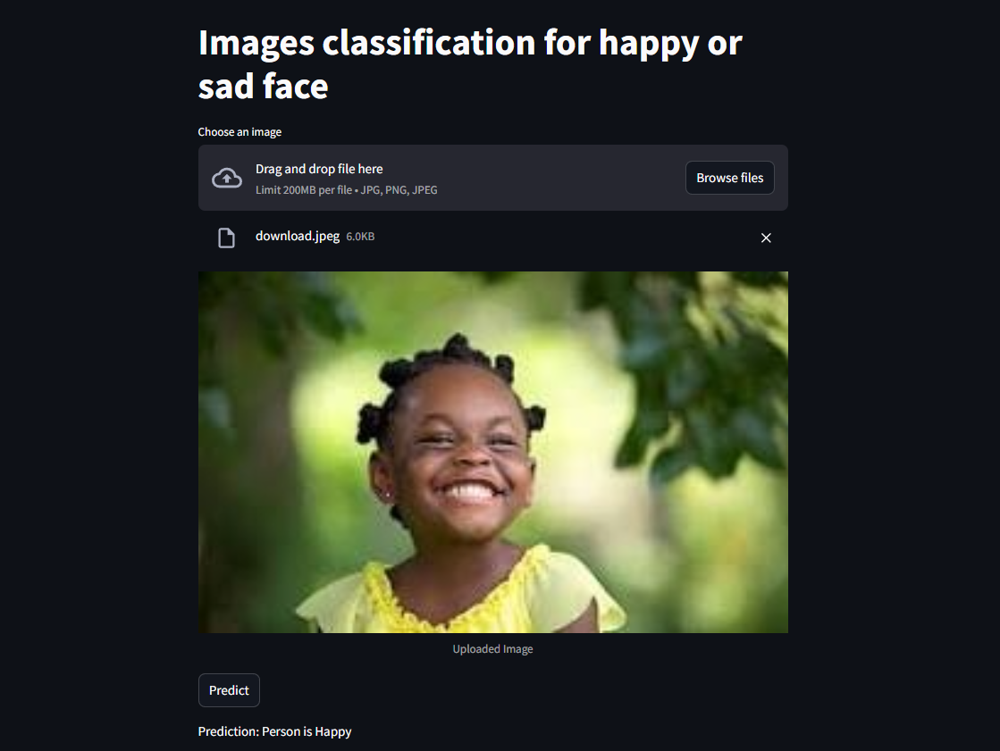

# Image Classifier

## Overview

The **Image Classifier** is a web-based application that uses a deep learning model to predict the category of an image. It is built with **Flask** for the backend and utilizes the **VGG19** pre-trained convolutional neural network (CNN) for image classification. The model is deployed in the application using **TensorFlow**. This project aims to provide an easy-to-use interface for users to upload images and get predictions about the image categories.

## Features

* Upload an image in formats such as `.png`, `.jpg`, or `.jpeg`.
* Displays the uploaded image for preview.
* Predicts the image category using the VGG19 model pre-trained on ImageNet data.
* Shows the predicted result with the image classification label.
* User-friendly web interface with intuitive design and smooth interactions.

## Tech Stack

* **Backend**: Python, Streamlit
* **Deep Learning Framework**: TensorFlow
* **Other Libraries**: Keras, werkzeug

## Screenshot



*The uploaded image and predicted result are displayed in the interface after clicking the Predict! button.*

## Installation

### Prerequisites

* Python 3.x
* pip (Python package manager)

### Setting Up the Project

1. Clone this repository:

   ```bash
   git clone https://github.com/your-username/image-classifier.git
   ```

2. Navigate to the project directory:

   ```bash
   cd image-classifier
   ```

3. Run the Flask application:

   ```bash
   Streamlit run app.py
   ```

4. Open the application in your browser at `http://127.0.0.1:5000/`.

## License

This project is open-source and available under the MIT License.

## Acknowledgements

* Streamlit for creating the web application.
* TensorFlow and Keras for providing the deep learning framework and pre-trained model.

